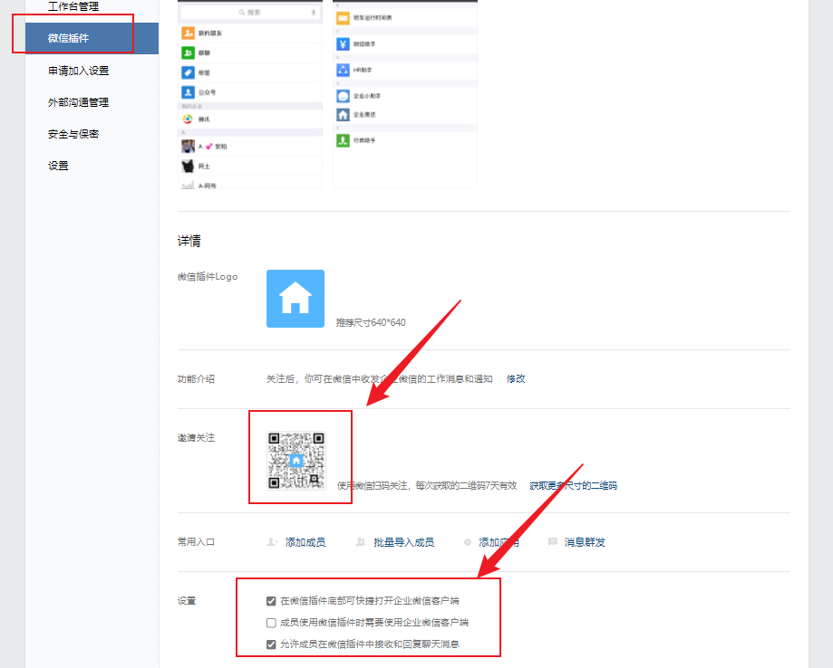
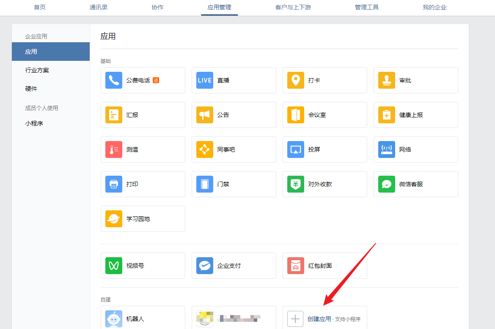
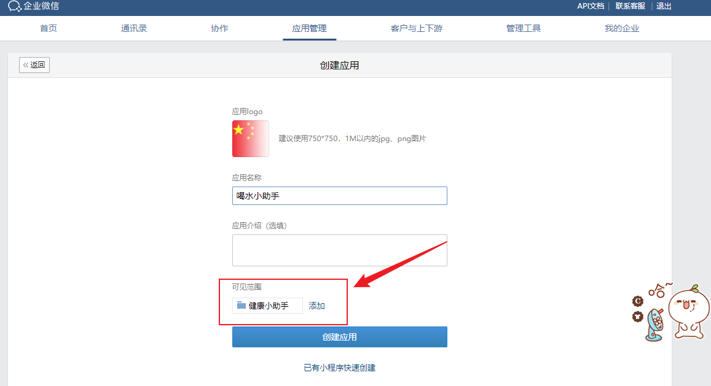
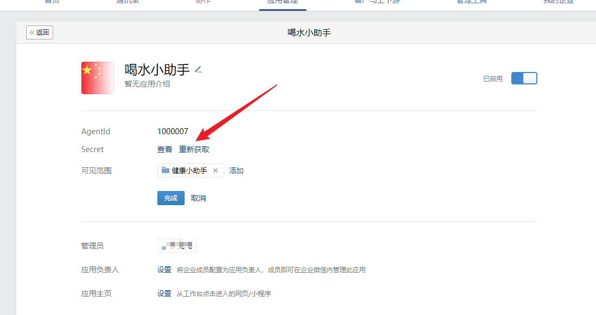
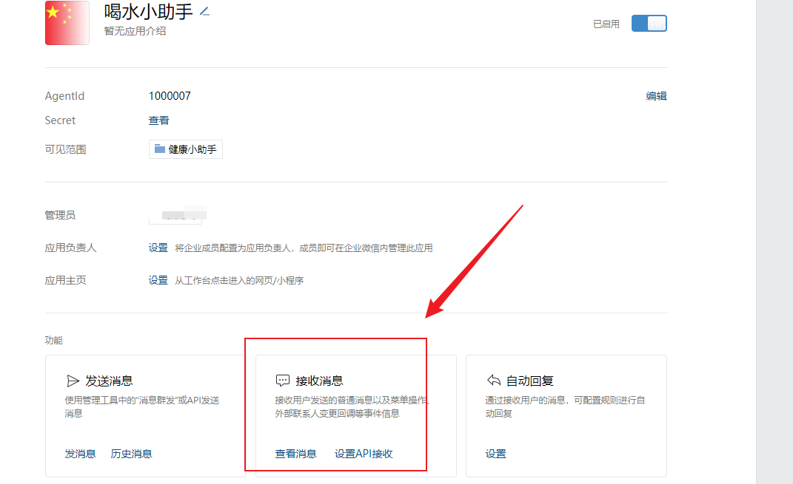
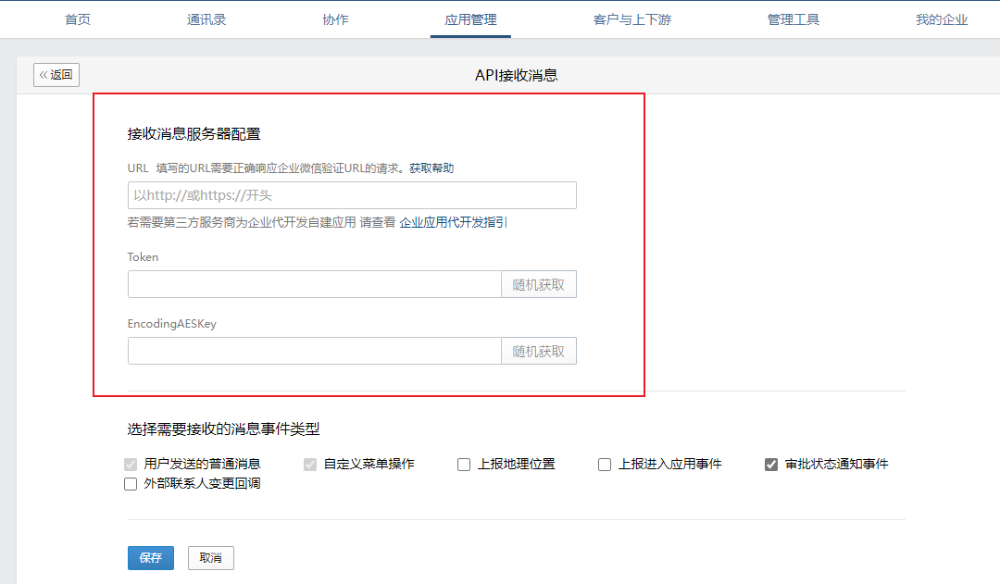

# 企业微信自建应用配置流程
1. [注册企业微信](https://work.weixin.qq.com/wework_admin/loginpage_wx?from=myhome_openApi)
2. 复制企业id到env配置
   
   - env: `WECHAT_WORK_CORP_ID=`
3. 关注微信插件(这样就可以在微信里面接收消息，摆脱企业微信)
    
4. 添加自建应用，注意把可见范围设置成最大
   
   
5. 获取 `secret`
   
6. 设置api接收消息
   
   
   填写回调地址同时生成token和secret，并将分别填写到env配置里面
   - 回调地址：`你的域名.com/wework/callback`
   - env配置：
   ```bash
   WECHAT_WORK_SECRET=uTnft3cWgcp0sZvxonPwVk2gZNmDOd1iBk_WbZLQ9w8
   WECHAT_WORK_TOKEN=cjXGMKae4ZLdAr8VLPG
   WECHAT_WORK_AES_KEY=UbxVV2ajAGzOIwwWitREh2l4flGBvoCgODCbomUcmNp
   ```

7. 手动同步成员 `php artisan sync:user` ，能成功获取到成员(`wework_users`)就说明配置成功
8. enjoy it!
