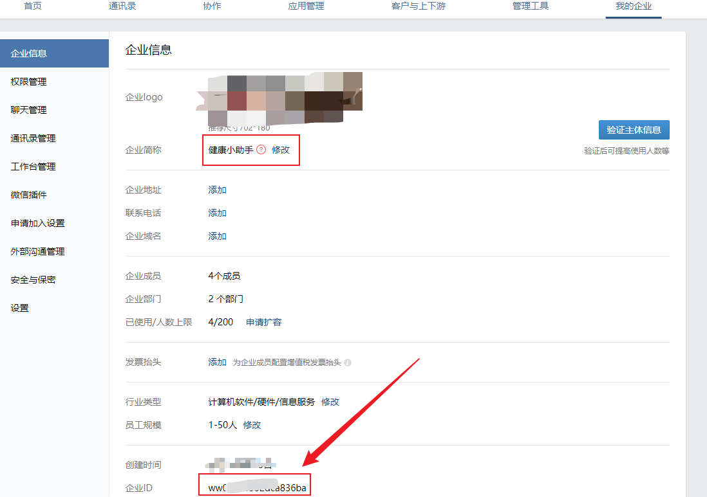

# 企业微信自建应用配置流程
1. [注册企业微信](https://work.weixin.qq.com/wework_admin/loginpage_wx?from=myhome_openApi)
2. 复制企业id到env配置
   
   - env: `WECHAT_WORK_CORP_ID=`
3. 关注微信插件(这样就可以在微信里面接收消息，摆脱企业微信)
    
4. 添加自建应用，注意把可见范围设置成最大
   
   
5. 获取 `secret` 及 `agent_id`
   
6. 设置api接收消息
   
   
   填写回调地址同时生成token和secret，并将分别填写到env配置里面
   - 回调地址：`你的域名.com/wework/callback`
   - env配置：
   ```bash
   WECHAT_WORK_SECRET=
   WECHAT_WORK_TOKEN=
   WECHAT_WORK_AES_KEY=
   WECHAT_WORK_AGENT_ID=
   ```

7. 手动同步成员 `php artisan sync:user` ，能成功获取到成员(`wework_users`)就说明配置成功
8. `php artisan hello`,发送一条测试信息（可见范围内的所有人都可以收到）
9. 登录后台 你的域名.com/你的域名路径（env中设置，默认admin），输入账号 admin/admin
10. enjoy it!
